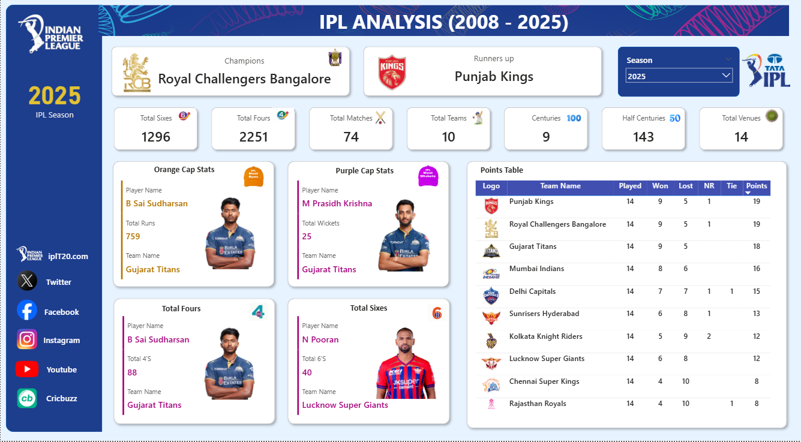

# 🏏 IPL Analysis Dashboard (2008–2025)



## 📖 Overview

The IPL Analysis Dashboard is an interactive Power BI project designed to provide comprehensive insights into the Indian Premier League (IPL) from 2008 to 2025.

This dashboard enables users to analyze team performances, player statistics, tournament records, points tables, Orange Cap and Purple Cap winners, batting achievements, and season-wise trends through dynamic visualizations and interactive filters.

---

## 📸 Dashboard Preview


---

## 🎯 Key Features

### 🏆 Season Overview
- IPL Champion Team
- Runner-Up Team
- Season Selection Filter
- Season-wise Analysis

### 📊 Tournament Statistics
- Total Matches
- Total Teams
- Total Venues
- Total Fours
- Total Sixes
- Centuries
- Half-Centuries

### 🏏 Batting Analysis
- Orange Cap Winner
- Highest Run Scorer
- Most Fours
- Most Sixes
- Team-wise Batting Performance

### 🎯 Bowling Analysis
- Purple Cap Winner
- Highest Wicket Taker
- Bowling Performance Metrics

### 📋 Points Table
- Matches Played
- Wins
- Losses
- No Result Matches
- Tied Matches
- Points
- Team Rankings

### 🔍 Interactive Features
- Dynamic Season Filter
- Team Analysis
- Player Analysis
- Responsive Visualizations
- Drill-Down Capabilities

---

## 📂 Dataset Used

The project uses multiple IPL datasets:

### 1. Ball-by-Ball Data
Contains:
- Match ID
- Batter
- Bowler
- Runs Scored
- Extras
- Wickets
- Over Information
- Batting Team
- Bowling Team

### 2. Match Data
Contains:
- Match Details
- Teams
- Venue
- Date
- Toss Information
- Match Result
- Season Information

### 3. Player Data
Contains:
- Player Name
- Batting Style
- Bowling Style
- Playing Role
- Team Information

### 4. Team Data
Contains:
- Team Name
- Team Short Name
- Team Logos
- Franchise Details

---

## 🛠️ Tools & Technologies

| Tool | Purpose |
|--------|---------|
| Power BI | Dashboard Development |
| Power Query | Data Cleaning & Transformation |
| DAX | Measures & Calculations |
| Excel / CSV | Data Storage |
| Data Modeling | Relationship Building |

---

## 📈 KPIs Included

### Tournament KPIs
- Total Matches
- Total Teams
- Total Venues
- Total Fours
- Total Sixes
- Total Centuries
- Total Half-Centuries

### Player KPIs
- Orange Cap Winner
- Purple Cap Winner
- Most Fours
- Most Sixes

### Team KPIs
- Champion Team
- Runner-Up Team
- Team Rankings
- Season Performance

---

## 📁 Project Structure

```text
IPL-Analysis-Dashboard
│
├── Dashboard.pbix
│
├── Datasets
│   ├── ball_by_ball_data.csv
│   ├── ipl_matches_data.csv
│   ├── players-data-updated.csv
│   └── teams_data.csv
│
├── Images
│   └── Output Image.png
│
└── README.md
```

---

## 🚀 Dashboard Insights

This dashboard helps users:

✅ Analyze IPL history from 2008–2025

✅ Compare team performances across seasons

✅ Track top batting performers

✅ Track top bowling performers

✅ View season champions and runners-up

✅ Understand scoring trends

✅ Explore venue-wise statistics

✅ Evaluate team standings through points tables

---

## 🔮 Future Enhancements

- Player vs Player Comparison
- Team vs Team Analysis
- Predictive Analytics
- Match Winner Prediction
- Advanced Performance Metrics
- Live IPL Data Integration
- Mobile Optimized Dashboard

---

## 👨‍💻 Author

### Ravi Teja

**Power BI Developer | SQL Developer | Data Analyst**

#### Skills
- Power BI
- SQL
- DAX
- Power Query
- Data Visualization
- Data Analytics
- Data Modeling

---

## 🌟 Support

If you found this project useful:

⭐ Star this repository

🍴 Fork this repository

📢 Share it with others

---

## 📬 Contact

Feel free to connect on:

 🔗 GitHub: https://github.com/Raviteja0710  
 🔗 LinkedIn Profile: https://www.linkedin.com/in/ch-ravi-teja-b00139367/

